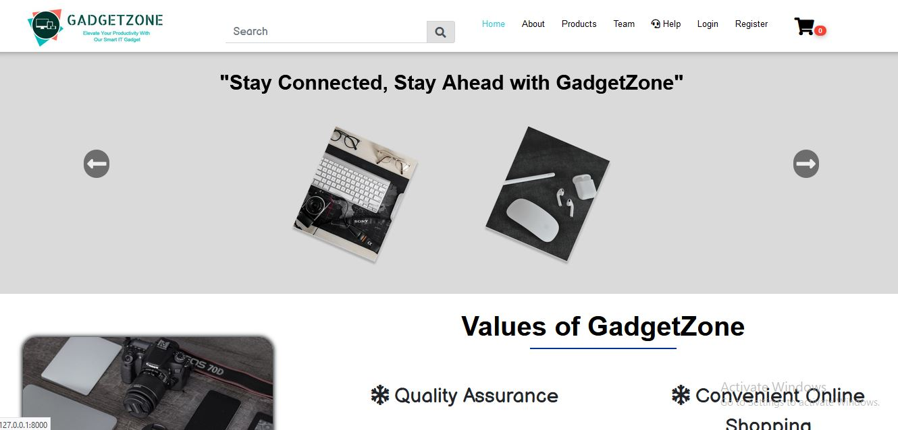

 

## Laravel Ecommerce Project with Complete Source Code

The Laravel Ecommerce Project with Complete Source Code is a PHP-based web application, For a detailed features, and functionalities of the Laravel Ecommerce Project  

## Features
- User Dashboard
- Admin Dashboard
- Mobile-Friendly Website
- 3 Step Booking Process
- Order Tracking
- Email Notifications
- Subscriber Form
- A product search form
- Payment Gateway(PayU) Integrated
- Shopping Cart in a Responsive Layout
- Pre-Defined Content with High-Resolution Photos
- Search engine optimization (SEO) for Products
- Recommendations and related products in our categories

## Requirements 
-   Laravel <=5.8
-   PHP <= 7.1.3
-   Composer Version 2 
## Installation Steps 

1.  <code> composer create-project ThapaBinaya/GadgetZone </code>
2. Create database for  your project with the name as <code>gadgetzone</code>
3. Now Run <code>php artisan migrate</code> command for creating all the tables 
4. Add your email credentials in <code>.env</code> fil
5. Start yor project using <code>php artisan serve</code>

### Dashboard Details
- Admin : http://127.0.0.1:8000/admin-dash
    -   Login Id : satik.thapa@gmail.com
    -   Password : 123456789
- User  : http://127.0.0.1:8000/dashboard 
 

## License

The project developed using laravel framework is open-source software licensed under the [MIT license](https://opensource.org/licenses/MIT).
